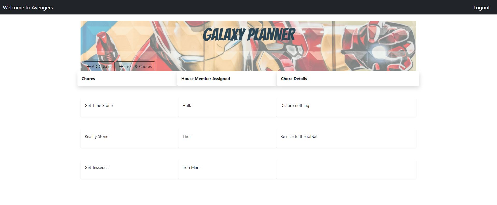

# Galaxy

[Galaxy Planning](https://galaxy-planner.herokuapp.com/) is a full-stack application designed to make household planning easier. A user or users can keep track of what chores each person is responsible for. Themed around superheros, the app creators hope that this increases interactivity and engagement for younger members of each household.

All credentials are protected with encryption. A Sequelize ORM coupled with GET and POST enables server-side CRUD functionality.

## Table of Contents

* [Installation](#installation)
* [Technologies](#technologies)
* [Standards](#standards)
* [Images](#images)
* [Contributors](#contributors)
* [License](#license)
* [Live Deployment & Repo Links](#links)
* [Contact](#contact)

## Installation

### How to launch on Local Host:

1. Install all dependencies by running `npm install` in your terminal (no arguments).
    - by default npm will install all modules listed as depencies in package.json.
    - if nodemon is not installed globally run npm install nodemon in the command line for this project.
        - global nodemon install code: `npm install nodemon -g`
2. Copy and Paste the schema into MySQL Workbench and run all code.
3. Launch the application front-end in the command line with `nodemon server.js`
4. Nodemon will show what localhost the project is launched on (most likely http://localhost:8080/). Follow the link.

## Technologies

- Bootstrap 5.0
- MySQL & Workbench
- Vanilla JS
- Heroku
- Node.js
- AJAX
- NPM
    - express
    - dotenv
    - bcryptjs
    - mysql2
    - sequelize
    - passport
    - handlebars.js
    - nodemon

## Standards

- Meets MVC Folder Structure Paradigm Standards

## Images

## Contributors

###                Sam Ayler
                                                      

###        Kailee Smith

###              Cameron Wright

## Links

Github Repo: your repo here

Live Deployment: https://galaxy-planner.herokuapp.com/

## License

### MIT License 

## Contact

- YOUR NAME HERE
    - EMAIL:
    - GITHUB

